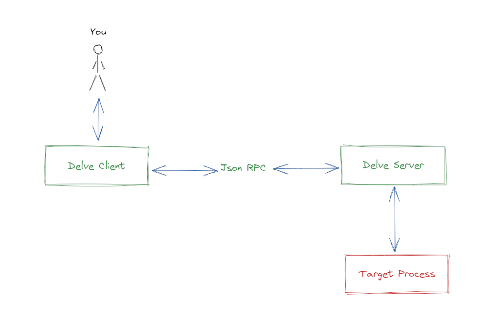

## Debugging Sessions

There are a number of ways to start a debugging session with Delve.

### `debug`

If you would like to debug a `main` package you can use `dlv debug`. You saw
how this works in the previous sections. You can optionally give `dlv debug`
an argument which is the package you'd like to debug.
For instance, if you want to use Delve to debug
[beetools](github.com/pippolo84/beetools) you can do:

```
$ go get -d github.com/pippolo84/beetools/cmd/beetools
$ dlv debug github.com/pippolo84/beetools/cmd/beetools
Type 'help' for list of commands.
(dlv) 
```

But what `dlv debug` is exactly doing? Let's try to find out using `execsnoop`.
Move to the `simple` directory, then open up another terminal and run
`execsnoop`:

```
$ sudo execsnoop-bpfcc

PCOMM            PID    PPID   RET ARGS

```

To do this you'll need root privileges, since `execsnoop` uses eBPF to attach
to a kernel tracepoint on the `execve` syscall.

Now, let's run `dlv debug`:

```
$ dlv debug
Type 'help' for list of commands.
(dlv) 
```

On the other terminal we'll see (I filtered out uninteresting lines):

```
$ sudo execsnoop-bpfcc

PCOMM            PID    PPID   RET ARGS

...

go               1984   1977     0 /usr/local/go/bin/go build -o /home/vagrant/debugging-with-delve/03-debugging-sessions/simple/__debug_bin -gcflags all=-N -l

...

__debug_bin      2024   1977     0 /home/vagrant/debugging-with-delve/03-debugging-sessions/simple/__debug_bin

```

So `dlv debug` is a shortcut to:

- build your package with optimizations disabled (`-gcflags all=-N -l`)
- start the resulting binary, named `__debug_bin` under `dlv` control

### `test`

`dlv test` allows you to debug your tests. Let's debug the tests in the
`isogram` package, inside the `server` folder.

```
$ dlv test -- -test.v
Type 'help' for list of commands.
(dlv) list TestIsogram
Showing /home/vagrant/debugging-with-delve/03-debugging-sessions/server/isogram/isogram_test.go:27 (PC: 0x547a8a)
    22:			input:    "advanced",
    23:			expected: false,
    24:		},
    25:	}
    26:	
    27:	func TestIsogram(t *testing.T) {
    28:		for _, tc := range testCases {
    29:			t.Run(tc.name, func(t *testing.T) {
    30:				got := IsIsogram(tc.input)
    31:				if got != tc.expected {
    32:					t.Fatalf("IsIsogram(%q) returned %t, expected %t", tc.input, got, tc.expected)
(dlv) c
=== RUN   TestIsogram
=== RUN   TestIsogram/empty_word
=== RUN   TestIsogram/isogram
=== RUN   TestIsogram/non-isogram
--- PASS: TestIsogram (0.00s)
    --- PASS: TestIsogram/empty_word (0.00s)
    --- PASS: TestIsogram/isogram (0.00s)
    --- PASS: TestIsogram/non-isogram (0.00s)
PASS
Process 2790 has exited with status 0
(dlv)
```

If you want to pass arguments to the executable under test, just put them after
the `--` while running Delve.
Note that we are using `-test.v` to have a test verbose output, instead of the
usual `-v`. Why?
Let's take a look at what `dlv test` is doing tracing it with `execsnoop`:

```
$ sudo execsnoop-bpfcc 

PCOMM            PID    PPID   RET ARGS

...

go               2807   2801     0 /usr/local/go/bin/go test -c -o /home/vagrant/debugging-with-delve/03-debugging-sessions/server/isogram/debug.test -gcflags all=-N -l

...

debug.test       2853   2801     0 /home/vagrant/debugging-with-delve/03-debugging-sessions/server/isogram/debug.test -test.v
```

So, Delve is generating the test binary using the `-c` option. Let's do it on
our own, to ask the binary itself how we should pass the flags:

```
$ go test -c
$ ls
isogram.go  isogram.test  isogram_test.go
$ ./isogram.test -h
Usage of ./isogram.test:
  -test.bench regexp
    	run only benchmarks matching regexp
  -test.benchmem
    	print memory allocations for benchmarks
  -test.benchtime d
    	run each benchmark for duration d (default 1s)
  -test.blockprofile file
    	write a goroutine blocking profile to file
  -test.blockprofilerate rate
    	set blocking profile rate (see runtime.SetBlockProfileRate) (default 1)
  -test.count n
    	run tests and benchmarks n times (default 1)
  -test.coverprofile file
    	write a coverage profile to file
  -test.cpu list
    	comma-separated list of cpu counts to run each test with
  -test.cpuprofile file
    	write a cpu profile to file
  -test.failfast
    	do not start new tests after the first test failure
  -test.fuzz regexp
    	run the fuzz test matching regexp
  -test.fuzzcachedir string
    	directory where interesting fuzzing inputs are stored (for use only by cmd/go)
  -test.fuzzminimizetime value
    	time to spend minimizing a value after finding a failing input (default 1m0s)
  -test.fuzztime value
    	time to spend fuzzing; default is to run indefinitely
  -test.fuzzworker
    	coordinate with the parent process to fuzz random values (for use only by cmd/go)
  -test.list regexp
    	list tests, examples, and benchmarks matching regexp then exit
  -test.memprofile file
    	write an allocation profile to file
  -test.memprofilerate rate
    	set memory allocation profiling rate (see runtime.MemProfileRate)
  -test.mutexprofile string
    	write a mutex contention profile to the named file after execution
  -test.mutexprofilefraction int
    	if >= 0, calls runtime.SetMutexProfileFraction() (default 1)
  -test.outputdir dir
    	write profiles to dir
  -test.paniconexit0
    	panic on call to os.Exit(0)
  -test.parallel n
    	run at most n tests in parallel (default 2)
  -test.run regexp
    	run only tests and examples matching regexp
  -test.short
    	run smaller test suite to save time
  -test.shuffle string
    	randomize the execution order of tests and benchmarks (default "off")
  -test.testlogfile file
    	write test action log to file (for use only by cmd/go)
  -test.timeout d
    	panic test binary after duration d (default 0, timeout disabled)
  -test.trace file
    	write an execution trace to file
  -test.v
    	verbose: print additional output
```

When calling a precompiled test binary, we must prepend each flag option with
`test.`

### `exec`

You might already have your program compiled and you want Delve to run it and
attach to it. In that case you can use `delve exec`.

Beware how you build your executable. By default, the Go compiler has
optimizations enabled. This may result in a more difficult debugging session.
Specifically, there are two optimization types that we should be aware of:

- function inlining
- variable registerization

Regarding the first, we can ask the compiler to show its decisions regarding
inlining while building with the `-m` flags:

```
$ go build -gcflags="-m=2"
# github.com/develersrl/debugging-with-delve/03-debugging-sessions/optimizations
./main.go:3:6: can inline sum with cost 9 as: func(int, int) int { s := a + b; return s }
./main.go:9:6: can inline number with cost 2 as: func() int { return 10 }
./main.go:13:6: can inline main with cost 39 as: func() { a := 10; b := 5; c := sum(a, b); println(c); n := number(); println(n) }
./main.go:17:10: inlining call to sum
./main.go:20:13: inlining call to number
```

For each function, the Go compiler will calculate an inline cost. If this cost
does not exceed a threshold, the function will be inlined.
In this example, both `sum` and `number` will be inlined.

Let's see what this mean for our debugging sessions:

```
$ dlv exec ./optimizations 
Type 'help' for list of commands.
(dlv) b main.sum
Command failed: location "main.sum" not found
(dlv) b main.number
Command failed: location "main.number" not found
(dlv)
```

The `main.sum` and `main.number` symbols are inexistent, and so unavailable for
breakpoints. Besides, we cannot step into those functions, too.

```
(dlv) b main.go:17
Breakpoint 1 set at 0x455214 for main.main() ./main.go:17
(dlv) c
> main.main() ./main.go:17 (hits goroutine(1):1 total:1) (PC: 0x455214)
Warning: debugging optimized function
    12:	
    13:	func main() {
    14:		a := 10
    15:		b := 5
    16:	
=>  17:		c := sum(a, b)
    18:		println(c)
    19:	
    20:		n := number()
    21:		println(n)
    22:	}
(dlv) s
> main.main() ./main.go:18 (PC: 0x455215)
Warning: debugging optimized function
    13:	func main() {
    14:		a := 10
    15:		b := 5
    16:	
    17:		c := sum(a, b)
=>  18:		println(c)
    19:	
    20:		n := number()
    21:		println(n)
    22:	}
(dlv)
```

As expected, the `s` command (step into), is not working: we land on the next
line, not inside `sum` body.

The same goes for variable registerization.
Trying to print the value of `a` or `b` is not going to work:

```
(dlv) print a
(unreadable empty OP stack)
(dlv) print b
Command failed: could not find symbol value for b
```

To overcome this, we may try to show the disassembly of the executable, and see
how the compiler optimized our code.
Let's put ourselves on line 18 again.

```
(dlv) restart
Process restarted with PID 3533
(dlv) b main.go:18
Command failed: Breakpoint exists at /home/vagrant/debugging-with-delve/03-debugging-sessions/optimizations/main.go:18 at 455215
(dlv) c
> main.main() ./main.go:18 (hits goroutine(1):1 total:1) (PC: 0x455215)
Warning: debugging optimized function
    13:	func main() {
    14:		a := 10
    15:		b := 5
    16:	
    17:		c := sum(a, b)
=>  18:		println(c)
    19:	
    20:		n := number()
    21:		println(n)
    22:	}
(dlv) disass
TEXT main.main(SB) /home/vagrant/debugging-with-delve/03-debugging-sessions/optimizations/main.go
	main.go:13	0x455200	493b6610	cmp rsp, qword ptr [r14+0x10]
	main.go:13	0x455204	764e		jbe 0x455254
	main.go:13	0x455206	4883ec10	sub rsp, 0x10
	main.go:13	0x45520a	48896c2408	mov qword ptr [rsp+0x8], rbp
	main.go:13	0x45520f	488d6c2408	lea rbp, ptr [rsp+0x8]
	main.go:17	0x455214	90		nop
=>	main.go:18	0x455215*	e80683fdff	call $runtime.printlock
	main.go:18	0x45521a	b80f000000	mov eax, 0xf
	main.go:18	0x45521f	90		nop
	main.go:18	0x455220	e8fb89fdff	call $runtime.printint
	main.go:18	0x455225	e85685fdff	call $runtime.printnl
	main.go:18	0x45522a	e87183fdff	call $runtime.printunlock
	main.go:21	0x45522f	e8ec82fdff	call $runtime.printlock
	main.go:21	0x455234	b80a000000	mov eax, 0xa
	main.go:21	0x455239	e8e289fdff	call $runtime.printint
	main.go:21	0x45523e	6690		data16 nop
	main.go:21	0x455240	e83b85fdff	call $runtime.printnl
	main.go:21	0x455245	e85683fdff	call $runtime.printunlock
	main.go:22	0x45524a	488b6c2408	mov rbp, qword ptr [rsp+0x8]
	main.go:22	0x45524f	4883c410	add rsp, 0x10
	main.go:22	0x455253	c3		ret
	main.go:13	0x455254	e827cdffff	call $runtime.morestack_noctxt
	.:0		0x455259	eba5		jmp $main.main
(dlv) 
```

The command `disass` shows us the assembly instructions. If you look closely:

```
	main.go:18	0x45521a	b80f000000	mov eax, 0xf
```

You can see that the compiler has:
- inlined the `sum` function
- pre-calculated the sum at compile time
- emitted that instruction to move the result in `eax` register, where `$runtime.printint` will read it as its argument

Reading the assembly listing is not always that easy. But sometimes it is
necessary, as you may end up debugging starting from production executables,
where you want optimizations enabled.

If you end up in that situation, stepping through each single CPU instruction
with the `si` command and/or inspecting the status of the CPU registers with
`regs` may be handy.

Let's see how we can inspect the value of `Rax` register before and after the
`mov` instruction resulted from the optimizations.

First, we use `si` to step over a single assembly instruction:

```
(dlv) si
> runtime.printlock() /usr/local/go/src/runtime/print.go:66 (PC: 0x42d520)
Warning: debugging optimized function
    61:	// call print recursively. There is also the problem of a crash
    62:	// happening during the print routines and needing to acquire
    63:	// the print lock to print information about the crash.
    64:	// For both these reasons, let a thread acquire the printlock 'recursively'.
    65:	
=>  66:	func printlock() {
    67:		mp := getg().m
    68:		mp.locks++ // do not reschedule between printlock++ and lock(&debuglock).
    69:		mp.printlock++
    70:		if mp.printlock == 1 {
    71:			lock(&debuglock)
```

As expected, we jumped into `runtime.printlock`. To step out, we can use `so`:

```
(dlv) so
> main.main() ./main.go:18 (PC: 0x45521a)
Warning: debugging optimized function
Values returned:

    13:	func main() {
    14:		a := 10
    15:		b := 5
    16:	
    17:		c := sum(a, b)
=>  18:		println(c)
    19:	
    20:		n := number()
    21:		println(n)
    22:	}
```

Now, let's use `disass` again to check that we are exactly before the `mov` instruction:

```
(dlv) disass
TEXT main.main(SB) /home/vagrant/debugging-with-delve/03-debugging-sessions/optimizations/main.go
	main.go:13	0x455200	493b6610	cmp rsp, qword ptr [r14+0x10]
	main.go:13	0x455204	764e		jbe 0x455254
	main.go:13	0x455206	4883ec10	sub rsp, 0x10
	main.go:13	0x45520a	48896c2408	mov qword ptr [rsp+0x8], rbp
	main.go:13	0x45520f	488d6c2408	lea rbp, ptr [rsp+0x8]
	main.go:17	0x455214	90		nop
	main.go:18	0x455215*	e80683fdff	call $runtime.printlock
=>	main.go:18	0x45521a	b80f000000	mov eax, 0xf
	main.go:18	0x45521f	90		nop
	main.go:18	0x455220	e8fb89fdff	call $runtime.printint
	main.go:18	0x455225	e85685fdff	call $runtime.printnl
	main.go:18	0x45522a	e87183fdff	call $runtime.printunlock
	main.go:21	0x45522f	e8ec82fdff	call $runtime.printlock
	main.go:21	0x455234	b80a000000	mov eax, 0xa
	main.go:21	0x455239	e8e289fdff	call $runtime.printint
	main.go:21	0x45523e	6690		data16 nop
	main.go:21	0x455240	e83b85fdff	call $runtime.printnl
	main.go:21	0x455245	e85683fdff	call $runtime.printunlock
	main.go:22	0x45524a	488b6c2408	mov rbp, qword ptr [rsp+0x8]
	main.go:22	0x45524f	4883c410	add rsp, 0x10
	main.go:22	0x455253	c3		ret
	main.go:13	0x455254	e827cdffff	call $runtime.morestack_noctxt
	.:0		0x455259	eba5		jmp $main.main
```

Using `regs` we can inspect the CPU register values:

```
(dlv) regs
    Rip = 0x000000000045521a
    Rsp = 0x000000c000034768
    Rax = 0x00000000004e7200
    Rbx = 0x0000000000000001
    Rcx = 0x00000000004b8c40
    Rdx = 0x0000000000000000
    Rsi = 0x0000000000000002
    Rdi = 0x000000c00008c010
    Rbp = 0x000000c000034770
     R8 = 0x0000000000000001
     R9 = 0x0000000000000001
    R10 = 0x00007f55f679e888
    R11 = 0x000000c00008c000
    R12 = 0x000000c0000346d0
    R13 = 0x0000000000000000
    R14 = 0x000000c000002340
    R15 = 0x0000000000000040
 Rflags = 0x0000000000000216	[PF AF IF IOPL=0]
     Es = 0x0000000000000000
     Cs = 0x0000000000000033
     Ss = 0x000000000000002b
     Ds = 0x0000000000000000
     Fs = 0x0000000000000000
     Gs = 0x0000000000000000
Fs_base = 0x00000000004b8cd0
Gs_base = 0x0000000000000000

```

Then, after using `si` again to execute the `mov` instruction, we can see the
updated value for the `Rax` register:

```
(dlv) si
> main.main() ./main.go:18 (PC: 0x45521f)
Warning: debugging optimized function
    13:	func main() {
    14:		a := 10
    15:		b := 5
    16:	
    17:		c := sum(a, b)
=>  18:		println(c)
    19:	
    20:		n := number()
    21:		println(n)
    22:	}
(dlv) disass
TEXT main.main(SB) /home/vagrant/debugging-with-delve/03-debugging-sessions/optimizations/main.go
	main.go:13	0x455200	493b6610	cmp rsp, qword ptr [r14+0x10]
	main.go:13	0x455204	764e		jbe 0x455254
	main.go:13	0x455206	4883ec10	sub rsp, 0x10
	main.go:13	0x45520a	48896c2408	mov qword ptr [rsp+0x8], rbp
	main.go:13	0x45520f	488d6c2408	lea rbp, ptr [rsp+0x8]
	main.go:17	0x455214	90		nop
	main.go:18	0x455215*	e80683fdff	call $runtime.printlock
	main.go:18	0x45521a	b80f000000	mov eax, 0xf
=>	main.go:18	0x45521f	90		nop
	main.go:18	0x455220	e8fb89fdff	call $runtime.printint
	main.go:18	0x455225	e85685fdff	call $runtime.printnl
	main.go:18	0x45522a	e87183fdff	call $runtime.printunlock
	main.go:21	0x45522f	e8ec82fdff	call $runtime.printlock
	main.go:21	0x455234	b80a000000	mov eax, 0xa
	main.go:21	0x455239	e8e289fdff	call $runtime.printint
	main.go:21	0x45523e	6690		data16 nop
	main.go:21	0x455240	e83b85fdff	call $runtime.printnl
	main.go:21	0x455245	e85683fdff	call $runtime.printunlock
	main.go:22	0x45524a	488b6c2408	mov rbp, qword ptr [rsp+0x8]
	main.go:22	0x45524f	4883c410	add rsp, 0x10
	main.go:22	0x455253	c3		ret
	main.go:13	0x455254	e827cdffff	call $runtime.morestack_noctxt
	.:0		0x455259	eba5		jmp $main.main
(dlv) regs
    Rip = 0x000000000045521f
    Rsp = 0x000000c000034768
    Rax = 0x000000000000000f
    Rbx = 0x0000000000000001
    Rcx = 0x00000000004b8c40
    Rdx = 0x0000000000000000
    Rsi = 0x0000000000000002
    Rdi = 0x000000c00008c010
    Rbp = 0x000000c000034770
     R8 = 0x0000000000000001
     R9 = 0x0000000000000001
    R10 = 0x00007f55f679e888
    R11 = 0x000000c00008c000
    R12 = 0x000000c0000346d0
    R13 = 0x0000000000000000
    R14 = 0x000000c000002340
    R15 = 0x0000000000000040
 Rflags = 0x0000000000000216	[PF AF IF IOPL=0]
     Es = 0x0000000000000000
     Cs = 0x0000000000000033
     Ss = 0x000000000000002b
     Ds = 0x0000000000000000
     Fs = 0x0000000000000000
     Gs = 0x0000000000000000
Fs_base = 0x00000000004b8cd0
Gs_base = 0x0000000000000000

```

If possible, you can compile your program with the argument
`-gcflags=all='-N -l'` to disable optimizations. This is exactly what Delve
does for you when you run `dlv debug` or `dlv test`:

```
$ go build -gcflags=all='-N -l'
$ dlv exec ./optimizations 
Type 'help' for list of commands.
(dlv) b main.sum
Breakpoint 1 set at 0x45b4c0 for main.sum() ./main.go:3
(dlv) c
> main.sum() ./main.go:3 (hits goroutine(1):1 total:1) (PC: 0x45b4c0)
     1:	package main
     2:	
=>   3:	func sum(a, b int) int {
     4:		s := a + b
     5:	
     6:		return s
     7:	}
     8:	
(dlv) args
a = 10
b = 5
~r0 = 4234809
(dlv)
```

### `attach`

If your program is already running, you can debug it by telling Delve to
attach to its PID. For this example, we will need to open three different
terminals. In the first terminal let's compile and run an HTTP server that
will return random numbers.

```
$ cd server
$ go build -gcflags=all='-N -l'
$ ./server 
2022/05/22 17:17:33 listening on localhost:12345
```

On another terminal:

```
$ curl localhost:12345/lumberjack
YES
$ curl localhost:12345/debugging
NO
```

Our server is up and running. When we query it, it returns `YES` or `NO` if the
URL path contains an isogram or not, respectively.
On a third terminal, let's attach Delve to the server.

```
$ dlv attach $(pidof server)
Type 'help' for list of commands.
(dlv) 
```

This will suspend execution of the server and land us at a `(dlv)` prompt. To
debug our server we should set a breakpoint on the handler:

```
(dlv) b main.handler
Breakpoint 1 set at 0x6e0f8f for main.handler() ./main.go:17
(dlv) 
```

We'll then want to continue execution of the server so it can accept requests:

```
(dlv) c
```

Now, when a request is made, the breakpoint will be hit and the debugger will
take control. Let's try that. In the second terminal make another request:

```
$ curl localhost:12345/debugging
```

This should block as the breakpoint has been hit:

```
> main.handler() ./main.go:17 (hits goroutine(8):1 total:1) (PC: 0x6e0f8f)
    12:	func main() {
    13:		log.Println("listening on localhost:12345")
    14:		log.Fatal(http.ListenAndServe("localhost:12345", http.HandlerFunc(handler)))
    15:	}
    16:	
=>  17:	func handler(w http.ResponseWriter, r *http.Request) {
    18:		log.Println(r.URL.Path)
    19:	
    20:		if isogram.IsIsogram(strings.TrimLeft(r.URL.Path, "/")) {
    21:			fmt.Fprintln(w, "YES")
    22:		} else {
(dlv) 
```

We can then inspect the request:

```
(dlv) p r.Header["User-Agent"][0]
"curl/7.81.0"
```

And continue to return the response to `curl`:

```
(dlv) c
```

To exit the debugger send it a SIGINT via Ctrl+C, which will land you back to
a `(dlv)` prompt. Here, you can quit with a `Ctrl-D`. Say no to not kill the
server process if you do not want to stop its execution.

### `--headless` mode

Move to the `03-debugging-sessions/stdin` directory and run `dlv debug` to
start a debug session, since the program is not yet running.
Let's list the source code:

```
(dlv) list main.main
Showing /home/vagrant/debugging-with-delve/03-debugging-sessions/stdin/main.go:32 (PC: 0x4aee0f)
    27:		}
    28:	
    29:		return true
    30:	}
    31:	
    32:	func main() {
    33:		fmt.Print("Insert a word: ")
    34:	
    35:		var word string
    36:		fmt.Scan(&word)
    37:	
(dlv) 
```

When we'll start it, we'll be asked to insert a word. To start, you can type
`continue` or just `c`:

```
(dlv) c
Insert a word: "" is an isogram!
Process 6129 has exited with status 0
(dlv) 
```

Wait... what!? It didn't worked that well!
It seems that the debugged program can't read from stdin. To avoid this, we
have to start a Delve server in headless mode, and attach a Delve client to
the server.

<div align="center">

</div>

Starting Delve in headless mode means to remove the integrated UI of Delve,
while listening for clients connection to attach and drive the server through
the Json RPC APIs.
What can be used as client to drive the Delve server? First of all, we can use
the terminal client integrated in Delve itself, starting it with `dlv connect`.
Other client examples are the VS Code plugin or the GUI frontend
[Gdlv](https://github.com/aarzilli/gdlv).

Using Delve as a server allows us to **remote debug** from a client machine
to a server machine where the executable and Delve are deployed. Beware that
Delve does not perform any kind of authorization or authentication while doing
this, so you do not want to do that on insecure networks.

Ok, let's put all of this in action.

```
$ dlv debug --headless --api-version 2
API server listening at: 127.0.0.1:40925
```

Doing this, Delve server will choose an ephimeral port for us (40925 in this
case).

Note that, if we want to specify a port on our own, we can use the `--listen`
option like this:

```
$ dlv debug --headless --listen :8888 --api-version 2
API server listening at: [::]:8888
2022-05-24T10:09:21Z warning layer=rpc Listening for remote connections (connections are not authenticated nor encrypted)
```

In another terminal:

```
$ dlv connect localhost:8888 --api-version 2
Type 'help' for list of commands.
(dlv) 
```

Now, we should be able to use the terminal with the Delve client to control the
debugger, while the one with the server will be used to send input to the
program under test.
Insert `c` in the Delve client and insert a word in the server.

On the server:

```
Insert a word: lumberjack
"lumberjack" is an isogram!
```

And back on the client:

```
(dlv) c
Process 9080 has exited with status 0
(dlv)
```

We can use `restart` to restart the execution of the program.

On the client:
```
(dlv) restart
Process restarted with PID 9096
(dlv) 
```

Now, let's use again the `continue` command on the client, and insert
another word on the server.

On the server:
```
Insert a word: debugging
"debugging" is not an isogram!
```

That's it for now. Let's close all with a *Ctrl-D* on the client side.