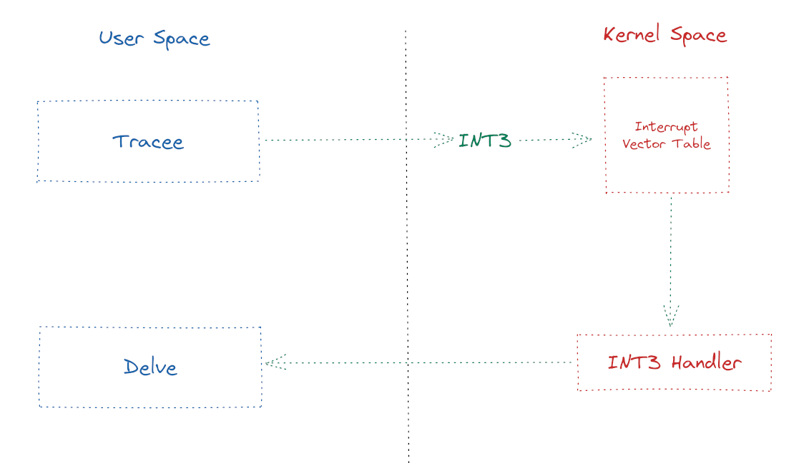

## Debuggers Under The Hood

Most of the functionality of a debugger is implemented by the
[ptrace][ptrace] syscall. This syscall allows a "tracer" process (the
debugger) to control a "tracee" process (your Go program). Through ptrace,
you can intercept the tracee's signals and syscalls, read and write to its
registers and memory and single-step through the program.
Since the debugger can write to the memory of the tracee, this allows it to set
breakpoints that will suspend execution of the tracee once they are hit.

Let's go over how this works.

We start by building our executable.

```
$ go build -gcflags=all='-N -l' -o break
```

Then, we want to list all of the symbols in it. We can do that with
`objdump -t`. As we can see, there are a lot of symbols. Besides, each symbol
for out Go code is in the form of `<package.symbol>`.

```
$ objdump -t break

break:     file format elf64-x86-64

SYMBOL TABLE:
0000000000000000 l    df *ABS*	0000000000000000 go.go
0000000000401000 l     F .text	0000000000000000 runtime.text
0000000000402300 l     F .text	000000000000022d cmpbody
0000000000402560 l     F .text	000000000000013e memeqbody
00000000004026e0 l     F .text	0000000000000117 indexbytebody
000000000045e5c0 l     F .text	0000000000000040 gogo

...

```

We can refine the search with a simple `grep`. We are interested in the
`BreakMe` function:

```
$ objdump -t break | grep main.BreakMe
0000000000496700 g     F .text	0000000000000077 main.BreakMe
```

The (virtual) address of the function, once loaded in memory, will be
`0x496700`.
To confirm that, let's start a debugging session with Delve, to disassemble the
binary code and check that address.

```
$ dlv exec ./break
Type 'help' for list of commands.
(dlv) disass -a 0x496700 0x496777
TEXT main.BreakMe(SB) /home/vagrant/debugging-with-delve/06-debuggers-under-the-hood/main.go
	main.go:6	0x496700	493b6610			cmp rsp, qword ptr [r14+0x10]
	main.go:6	0x496704	766a				jbe 0x496770
	main.go:6	0x496706	4883ec50			sub rsp, 0x50
	main.go:6	0x49670a	48896c2448			mov qword ptr [rsp+0x48], rbp
	main.go:6	0x49670f	488d6c2448			lea rbp, ptr [rsp+0x48]
	main.go:7	0x496714	440f117c2420		movups xmmword ptr [rsp+0x20], xmm15
	main.go:7	0x49671a	488d442420			lea rax, ptr [rsp+0x20]
	main.go:7	0x49671f	4889442418			mov qword ptr [rsp+0x18], rax
	main.go:7	0x496724	8400				test byte ptr [rax], al
	main.go:7	0x496726	488d1533770000		lea rdx, ptr [rip+0x7733]
	main.go:7	0x49672d	4889542420			mov qword ptr [rsp+0x20], rdx
	main.go:7	0x496732	488d15ff2c0200		lea rdx, ptr [rip+0x22cff]
	main.go:7	0x496739	4889542428			mov qword ptr [rsp+0x28], rdx
	main.go:7	0x49673e	8400				test byte ptr [rax], al
	main.go:7	0x496740	eb00				jmp 0x496742
	main.go:7	0x496742	4889442430			mov qword ptr [rsp+0x30], rax
	main.go:7	0x496747	48c744243801000000	mov qword ptr [rsp+0x38], 0x1
	main.go:7	0x496750	48c744244001000000	mov qword ptr [rsp+0x40], 0x1
	main.go:7	0x496759	bb01000000			mov ebx, 0x1
	main.go:7	0x49675e	4889d9				mov rcx, rbx
	main.go:7	0x496761	e8daabffff			call $fmt.Println
	main.go:8	0x496766	488b6c2448			mov rbp, qword ptr [rsp+0x48]
	main.go:8	0x49676b	4883c450			add rsp, 0x50
	main.go:8	0x49676f	c3					ret
	main.go:6	0x496770	e80b8efcff			call $runtime.morestack_noctxt
	.:0		0x496775	eb89					jmp $main.BreakMe
```

At address `0x496700` there is a `cmp` instruction, and then a conditional jump
`jbe` instruction. These instructions didn't seem the usual function prologue.
Instead, at `0x496706`, we can find the usual `sub` instruction, to reserve
space on the stack for the function local variables. Note that `rsp` is the
register holding the pointer to the current goroutine stack. This is the usual
function prologue we were expecting.

What are these two instructions?

Let's take a look at that address pointed to by the `jbe` instruction:

```
(dlv) disass -a 0x496770 0x496775
TEXT main.BreakMe(SB) /home/vagrant/debugging-with-delve/06-debuggers-under-the-hood/main.go
	main.go:6	0x496770	e80b8efcff	call $runtime.morestack_noctxt
```

Can you guess what this is all about?

If not, take a look at this talk: [An insight into Go Garbage Collection](https://www.youtube.com/watch?v=etRF1Cpx5Ok) <- ⚠️ shameless plug!

Back to our research: the address we are interested in is `0x496706`.
It is the address of `main.BreakMe`, minus that *strange* function prologue.

Let's examine the memory at that address:

```
(dlv) examinemem -count 4 -size 1 0x496706
0x496706:   0x48   0x83   0xec   0x50
```

As expected, we find the values `4883ec50`, just like the disassembly showed us
before. Those are simply the binary encoding of the first instruction of the
function.

Now, let's set a breakpoint at `main.BreakMe` and then inspect again the
memory:

```
(dlv) b main.BreakMe
Breakpoint 1 set at 0x496706 for main.BreakMe() ./main.go:6
(dlv) examinemem -count 4 -size 1 0x496706
0x496706:   0xcc   0x83   0xec   0x50   
(dlv) 
```

First of all, note how Delve set the breakpoint at `0x496706`. Just like we
did, Delve did not consider those two `cmp` and `jbe` instructions.
In other words, Delve knows how to cope with the specific implementation of the
Go functions prologue.
More interestingly, after the breakpoint has been set, the memory at that
address has changed. Now we have a `0xcc` at that address.

What is that? It is the x86 opcode for an [INT3] instruction. When the CPU
executes that instruction, it will generate an interrupt, so that the kernel
will take over and execute a specific Interrupt Handler.
Since the tracer process has registered itself as such with the `ptrace`, the
handler won't deliver the `SIGTRAP` to the tracee, instead it will inform the
tracer that the inferior has changed state.
The execution of the tracee is now halted, giving the possibility for the
tracer to interact with its memory (e.g. inspecting local variables values).

<div align="center">

</div>

Can you guess what Delve does when we choose to `continue` the execution?

1. It writes the original instruction back over the trap one
1. It sets the tracee's program counter register to that memory address
1. It single steps the tracee to execute that instruction
1. It writes the trap back (so the breakpoint remains in place)
1. It resumes execution of the tracee

And that's it! This is the magic behind the debuggers!

[ptrace]: http://man7.org/linux/man-pages/man2/ptrace.2.html
[INT3]: https://en.wikipedia.org/wiki/INT_(x86_instruction)